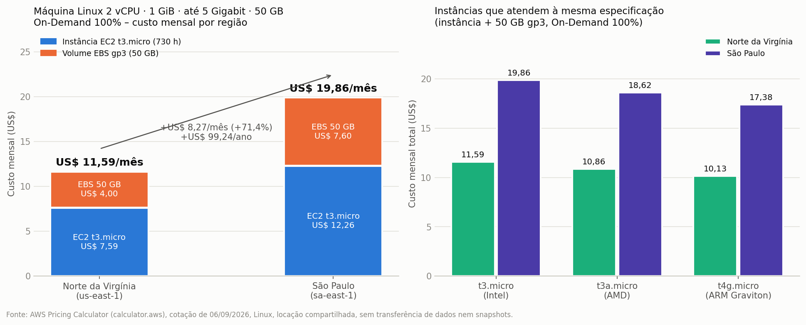

# FIAP

<p align="center">
<a href="https://www.fiap.com.br/"></a>
</p>

<br>

# FarmTech Solutions – Machine Learning na cabeça (PBL Fase 5)

## Grupo 69

## Integrantes:

- <a href="https://github.com/ronishime">Ronaldo Keity Sieg Nishime (RM571759)</a>

## Professores:

### Coordenador(a)

- André Godoi

---

## Descrição

Este repositório reúne as duas entregas obrigatórias da Fase 5 do curso de Tecnologia em Inteligência Artificial da FIAP, no contexto da **FarmTech Solutions**, que presta serviços de IA para uma fazenda de médio porte (200 hectares) produtora de várias culturas:

- **Entrega 1 – Machine Learning:** análise exploratória, descoberta de tendências de rendimento por clusterização, identificação de cenários discrepantes (outliers) e cinco modelos preditivos de regressão para prever o rendimento da safra a partir das condições climáticas. Todo o passo a passo, os achados e as conclusões estão no notebook Jupyter.
- **Entrega 2 – Computação em Nuvem:** estimativa de custos na calculadora da AWS para hospedar a API que recebe os dados dos sensores e executa o modelo, comparando as regiões de São Paulo (BR) e Norte da Virgínia (EUA), e a justificativa da região escolhida.

---

## Entrega 1 – Machine Learning

### Notebook

➡️ **[RonaldoKeitySiegNishime_rm571759_pbl_fase4.ipynb](RonaldoKeitySiegNishime_rm571759_pbl_fase4.ipynb)** – notebook com todas as células executadas.

O notebook conduz o leitor por todas as etapas da solução (metodologia CRISP-DM):

1. **Contexto e dicionário de dados** – a base `crop_yield.csv` relaciona quatro culturas com precipitação, umidade específica, umidade relativa, temperatura (todas medidas a 2 m do solo) e o rendimento da safra.
2. **Análise exploratória** – qualidade dos dados, estatísticas por cultura, distribuições, correlações globais e dentro de cada cultura.
3. **Aprendizado não supervisionado** – K-Means (cotovelo + silhueta), clusterização hierárquica, regimes de produtividade (baixo/médio/alto) dentro de cada cultura e detecção de outliers por três métodos (IQR, distância ao centróide e Isolation Forest).
4. **Regressão supervisionada** – cinco algoritmos (Regressão Linear, Árvore de Decisão, Random Forest, Gradient Boosting e SVR) em pipelines com pré-processamento, validação cruzada repetida, ajuste de hiperparâmetros com GridSearchCV, comparação com baselines e avaliação por MAE, RMSE, MAPE e R².
5. **Conclusões** – achados, pontos fortes e limitações do trabalho, além do modelo final salvo (`modelo_rendimento_safra.joblib`) pronto para ser servido pela API discutida na Entrega 2.

Em resumo, o que o leitor vai encontrar no notebook (detalhes, tabelas e gráficos estão lá):

- A base tem 39 anos de clima de uma mesma região cruzados com quatro culturas (cacau, dendê, arroz e borracha), cujos rendimentos diferem em até 20 vezes; o rendimento está em hg/ha (padrão FAOSTAT).
- Os cinco modelos atingem R² ≈ 0,98 no teste, mas um baseline de média por cultura chega a R² 0,99: a cultura explica quase toda a variação e o clima agrega pouco. O melhor modelo pela validação cruzada foi o Gradient Boosting (MAPE de 19% no teste; 9% no dendê e 10% no arroz).
- As tendências mais fortes são temporais (arroz e dendê em alta, borracha em queda) e os oito cenários discrepantes encontrados correspondem aos anos climáticos extremos da série, com efeitos opostos entre culturas.

### Vídeo demonstrativo (Entrega 1)

▶️ **[Vídeo 1 – Entrega 1 (Machine Learning) – YouTube, não listado](https://youtu.be/l0xuEOBYzeo)**

---

## Entrega 2 – Estimativa de custos na AWS

### Cenário

O modelo treinado na Entrega 1 precisa ser hospedado em uma máquina Linux simples na AWS, que executará uma API para receber os dados dos sensores (precipitação, umidades e temperatura) e devolver a previsão de rendimento. A cotação foi feita na **[Calculadora de Preços da AWS](https://calculator.aws/)**, em 06/09/2026, com a modalidade **On-Demand (utilização de 100%)** e a configuração pedida no enunciado:

| Requisito | Valor exigido | Como foi configurado na calculadora |
|-----------|---------------|-------------------------------------|
| CPU | 2 vCPUs | Instância **t3.micro** (2 vCPU) |
| Memória | 1 GiB | t3.micro (1 GiB) |
| Rede | Até 5 Gigabit | t3.micro (*Up to 5 Gigabit*) |
| Armazenamento | 50 GB | Volume EBS **SSD de uso geral (gp3)**, 50 GB, sem snapshots |
| Sistema operacional | Linux | Linux, locação compartilhada |
| Uso | 100% On-Demand | Carga de trabalho constante, 1 instância, 730 horas/mês |

A instância **t3.micro** foi escolhida porque é a instância x86 de geração atual que atende **exatamente** aos quatro requisitos. Na calculadora, ao filtrar por 2 vCPUs, 1 GiB e rede *Up to 5 Gigabit*, também aparecem a **t3a.micro** (processador AMD) e a **t4g.micro** (processador ARM Graviton), que são um pouco mais baratas e são apresentadas como alternativas na tabela abaixo.

### Comparação de custos: São Paulo × Norte da Virgínia

Valores mensais em dólares (USD), 730 horas/mês, conforme a calculadora da AWS:

| Item | Norte da Virgínia (us-east-1) | São Paulo (sa-east-1) | Diferença |
|------|------------------------------:|----------------------:|----------:|
| EC2 t3.micro Linux On-Demand (US$/hora) | 0,0104 | 0,0168 | +61,5% |
| EC2 t3.micro – 730 h/mês | **US$ 7,59** | **US$ 12,26** | +US$ 4,67 |
| EBS gp3 – 50 GB (US$/GB-mês) | 0,080 | 0,152 | +90,0% |
| EBS gp3 – 50 GB/mês | **US$ 4,00** | **US$ 7,60** | +US$ 3,60 |
| **Total mensal** | **US$ 11,59** | **US$ 19,86** | **+US$ 8,27 (+71,4%)** |
| **Total anual (12 meses)** | **US$ 139,08** | **US$ 238,32** | **+US$ 99,24** |

<p align="center">

</p>

Alternativas com a mesma especificação (2 vCPU, 1 GiB, até 5 Gigabit), também em On-Demand 100% e com os mesmos 50 GB gp3:

| Instância | Processador | N. Virgínia (US$/mês) | São Paulo (US$/mês) |
|-----------|-------------|----------------------:|--------------------:|
| t3.micro (cotação principal) | Intel x86 | 11,59 | 19,86 |
| t3a.micro | AMD x86 | 10,86 | 18,62 |
| t4g.micro | ARM Graviton | 10,13 | 17,38 |

Observações sobre a cotação:

- Os valores não incluem transferência de dados de saída (também mais cara em São Paulo), impostos nem monitoramento detalhado – itens que não constam nos requisitos do enunciado.
- Caso o volume fosse gp2 em vez de gp3, os totais seriam US$ 12,59 (N. Virgínia) e US$ 21,76 (São Paulo); a conclusão não muda.
- Com *Savings Plans* de 1 ou 3 anos a própria calculadora indica descontos de até 62% no custo por hora da instância, o que reduziria a diferença absoluta entre as regiões.

<!-- Sugestão: adicione aqui as capturas de tela da calculadora feitas durante a gravação do Vídeo 2, por exemplo:
<p align="center"> </p>
-->

### 1) Qual é a solução mais barata?

Considerando apenas o custo, a solução mais barata é hospedar a máquina na região **Norte da Virgínia (us-east-1)**: **US$ 11,59/mês contra US$ 19,86/mês** em São Paulo, uma economia de **US$ 8,27 por mês (41,6%)**, ou cerca de **US$ 99 por ano**. A diferença vem tanto do preço por hora da instância (61,5% maior em São Paulo) quanto do armazenamento EBS (90% mais caro em São Paulo), reflexo de custos de operação, energia e escala menores na região brasileira.

### 2) Acesso rápido aos dados dos sensores e restrições legais: qual opção escolher?

**Escolha: São Paulo (sa-east-1)**, mesmo sendo a opção mais cara. Justificativa:

1. **Restrição legal (LGPD).** O enunciado estabelece que há restrições legais para armazenamento no exterior. A Lei Geral de Proteção de Dados (Lei nº 13.709/2018) só permite a transferência internacional de dados nas hipóteses do art. 33 (país com nível adequado de proteção, cláusulas contratuais específicas, consentimento específico etc.). Hospedar a API e o banco de dados em Norte da Virgínia caracterizaria transferência internacional e exigiria esses mecanismos adicionais; em São Paulo os dados permanecem em território nacional, sob jurisdição brasileira, o que elimina o risco de não conformidade (as sanções da LGPD chegam a 2% do faturamento, limitadas a R$ 50 milhões por infração) e simplifica auditorias e contratos com a fazenda.
2. **Latência e acesso rápido aos sensores.** A fazenda está no Brasil. O tempo de ida e volta (RTT) típico entre uma conexão brasileira e a região de São Paulo fica em torno de 10 a 30 ms, enquanto para Norte da Virgínia fica em torno de 120 a 150 ms – de 5 a 10 vezes mais. Para uma API que recebe leituras de sensores continuamente (HTTP/MQTT), devolve previsões do modelo e alimenta dashboards e alertas quase em tempo real, a menor latência significa respostas mais rápidas, menos retransmissões em conexões rurais instáveis e melhor experiência para o gestor da fazenda.
3. **Viabilidade econômica.** A diferença de **US$ 8,27 por mês** é marginal frente ao valor do serviço e ao risco jurídico: menos do que o custo de uma hora de consultoria. Além disso, ela pode ser reduzida usando a **t4g.micro** (US$ 17,38/mês em São Paulo, ainda dentro da especificação) ou um *Savings Plan*, que a calculadora indica com desconto de até 62% na instância.
4. **Desempenho e operação.** As duas regiões oferecem a mesma família de instâncias, o mesmo tipo de volume gp3 e os mesmos serviços gerenciados necessários (EC2, EBS, monitoramento). Não há perda funcional ao escolher São Paulo – apenas o custo é maior – e a proximidade também facilita backups e recuperação de dados dentro do país.

Em resumo: **Norte da Virgínia é a opção mais barata, mas São Paulo é a opção correta** para este cenário, porque atende à exigência legal de manter os dados no Brasil e garante o acesso rápido aos dados dos sensores, com um custo adicional pequeno e previsível.

### Vídeo demonstrativo (Entrega 2)

▶️ **[Vídeo 2 – Entrega 2 (Custos AWS) – YouTube, não listado](https://youtu.be/o1vvP4piynQ)**

---

## Estrutura de pastas

- <b>RonaldoKeitySiegNishime_rm571759_pbl_fase4.ipynb</b>: notebook principal da Entrega 1, com todas as etapas e as saídas já executadas.
- <b>crop_yield.csv</b>: base de dados fornecida no portal da disciplina.
- <b>modelo_rendimento_safra.joblib</b>: modelo final treinado, gerado pelo notebook.
- <b>assets</b>: figuras geradas pelo notebook e o gráfico de comparação de custos da AWS (`aws_comparacao_custos.png`, gerado por `gerar_grafico_aws.py`). Os arquivos `mall.csv` e `moons.csv` são bases de exemplo do Cap. 10 e não são usados nesta entrega.
- <b>gerar_grafico_aws.py</b>: script que gera o gráfico da Entrega 2 a partir dos valores cotados na calculadora.
- <b>requirements.txt</b>: dependências do projeto.
- <b>README.md</b>: este arquivo.

## Como executar o código

Requisitos: Python 3.10 ou superior.

Localmente (Jupyter):

1. Instale as dependências:

```
pip install -r requirements.txt
```

2. Mantenha o arquivo `crop_yield.csv` na mesma pasta do notebook.

3. Abra o notebook:

```
jupyter notebook RonaldoKeitySiegNishime_rm571759_pbl_fase4.ipynb
```

4. Execute as células na ordem (menu *Run*, opção *Run All*). A execução completa leva poucos minutos; a busca de hiperparâmetros é a etapa mais demorada.

No Google Colab: faça o upload do notebook e do arquivo `crop_yield.csv` para a mesma pasta de trabalho e execute todas as células. Todas as bibliotecas usadas já estão disponíveis no Colab.

Para regenerar o gráfico da Entrega 2:

```
python gerar_grafico_aws.py
```

## Histórico de lançamentos

* 1.0.0 - 07/09/2026
    * Entrega 1: notebook com análise exploratória, clusterização, detecção de outliers e cinco modelos de regressão.
    * Entrega 2: comparação de custos AWS (São Paulo × Norte da Virgínia) e justificativa da região escolhida.

## Licença

MODELO GIT FIAP por FIAP está licenciado sobre Attribution 4.0 International.
